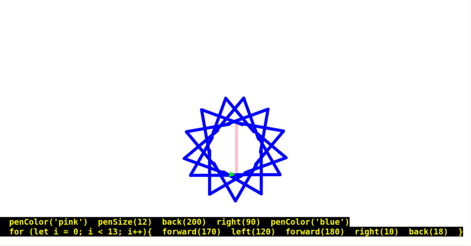
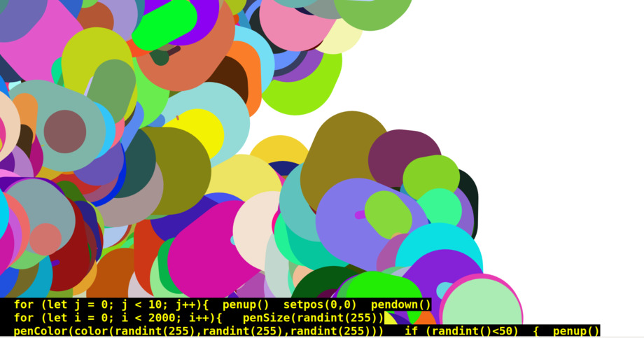
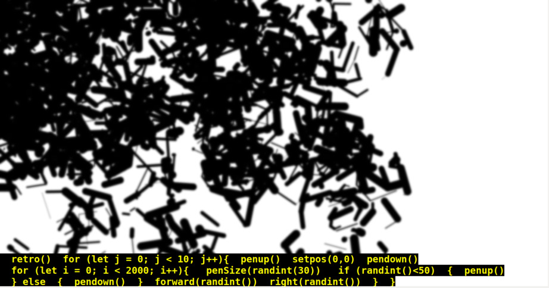

# PLOGO

Purchase LOGO

(currently named for my uni).

A toy language.

A kind of LOGO-like DSL built in the p5.js library.

This is a rudimentary proof of concept right now with globals and without implementing classes.  To write loops or *subroutines* one must use regular javascript.



## How to Use

Put your code inside the turtle function in turtle.js

## Reference Commands


### Movement

```
forward(n)
```
move n pixels ahead

```
back(n)
```
move n pixels back

```
left(Δ)  
```
turns Δ degrees to the left

```
right(Δ)
```
turns Δ degrees to the right

```
setpos(x,y)
```
moves turtle to x,y pixel coordinate. 0,0 is top left of window.

### Drawing

```
penup()
```
Going forward, Turtle will stop drawing a line with movement commands

```
pendown()
``` 
Turtle will start drawing lines tracing route.  **By default, pendown is on / true**

```
penColor('colorName')
```
penColor takes any color word: purple, grey, blue, etc. **The color name must be in quotes.**

Alternatively, a HTML color name, like #ff4d4d, may be specified in quotes. Example: ```penColor('#ff4d4d')```

Alternatively, a RGB color or RGBA color with transparency can be specified, with *color*. Example: ```penColor(color(255,0,255))```. See transparency example in examples section below.

```
penSize(n)
```
Width of pen in pixels

```
retro()
```
Adds a retro filter on the entire drawing. This command can be called anywhere and filter is always applied at the end of the program.

```
noConsole()
```
Turns off the default onscreen display of the program listing.
	       
### Randomness

```
randint(n)
```

or

```
randint()
```
Returns a random int between 0 and n. Specifying a value is optional. If no input *n*, the default is between 0 and 100. Example: ```forward(randint(30))```


## Examples

See examples folder.






### Updates

##### 2021-02-14

- Added onscreen console print of commands (on by default) and noConsole() to turn off
- Added more example files

##### 2021-02-07

- Re-render turtle() after screen resizing
- Added new setpos(x,y) function to move turtle to a position. A path will be drawn if the pen is currently down.
- add retro() command for retro filter. 
