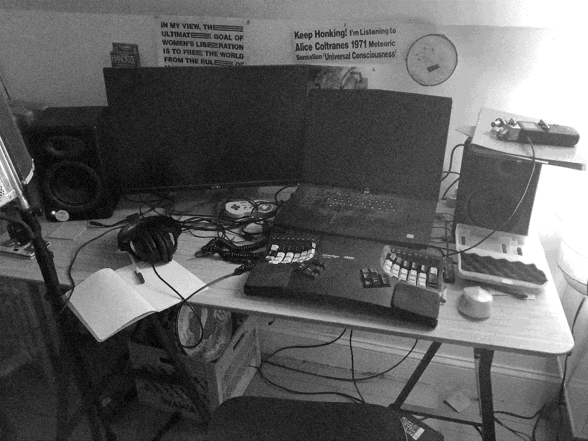
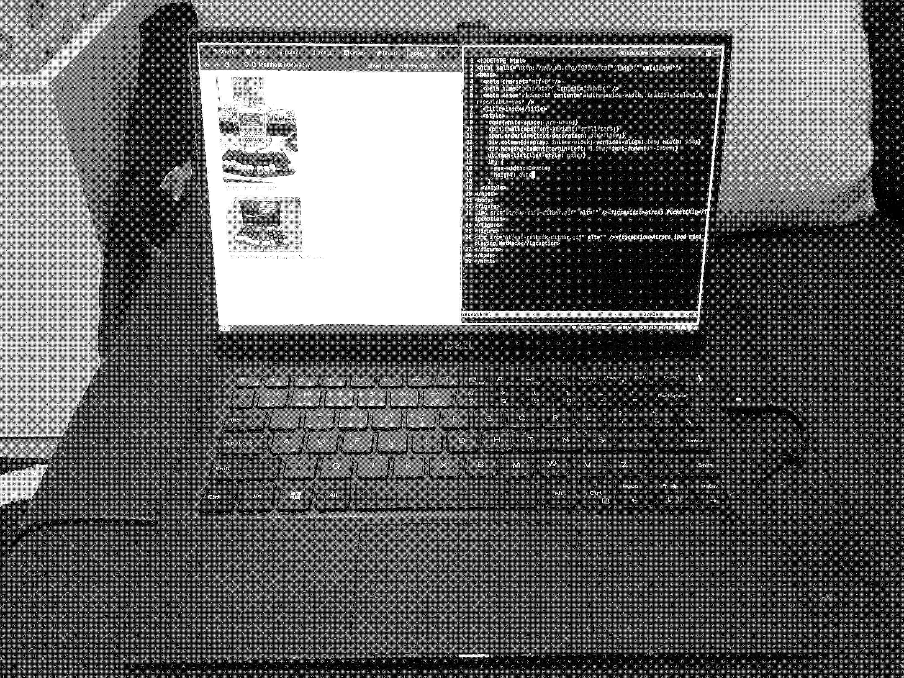

# Current Computers

  

## Pocket C.H.I.P. computer

By Next Thing, Co. Now out of business. This was an alternative to the Raspberry Pi, close to Raspberry Pi Zero, but came with Debian (linux) pre-installed, as well as Wifi and Bluetooth. RIP!

It works standalone but here I have it plugged into my portable Atreus keyboard by Keyboard.io.

[Radical DIY Computing Workshop notes and zine](https://github.com/lee2sman/RadicalDIYComputing_workshop)  
[ChipCommunity on Reddit](https://old.reddit.com/r/ChipCommunity/Archive) 

## iPad mini with Atreus keyboard

I've turned my iPad into a portable computer with the addition of the Atreus keyboard again.

## Alienware laptop

Not my fave computer, but I've had it a while. I ran Linux on it for a while. Probably should do it again. I use it for recording and editing my podcast, and for zoom streaming when I teach online. This is the Kinesis Advantage, which I picked up used and repaired.

## Dell XPS 13 laptop 

My regular everyday laptop. Running Ubuntu with Regolith Linux (i3).

