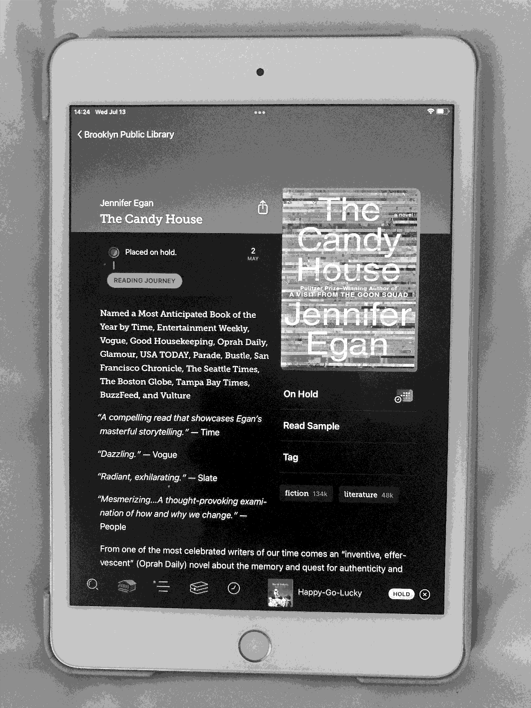
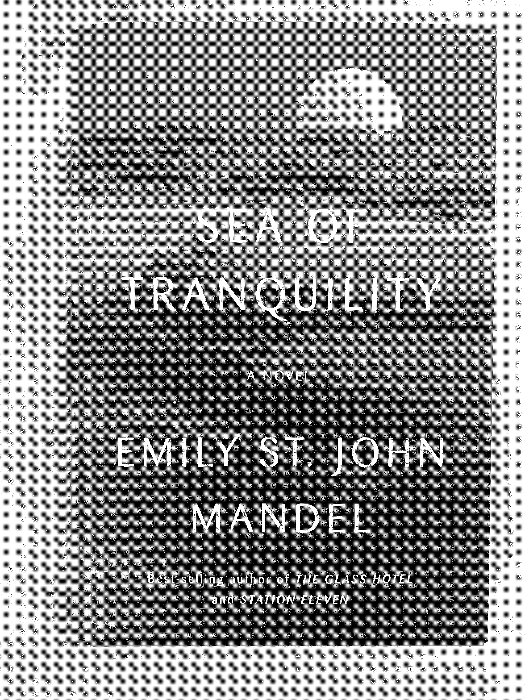

# What I'm Reading Lately - Spring 2022

### The Candy House - Jennifer Egan 

bought at a theater with a mini bookstore in the west village but i gave it away so photo here is on libby app. i really enjoy Egan's books. such a convoluted story. i had to create diagrams in my notebook to keep track of the different characters. i had dozens listed. it helped but after reading the book i lost the notebook. i find the story addictive. love the narrative told through so many characters. watched white wotus recently and it feels like a smaller (murder, mystery) version of what's happening here. wltimately, where does the story wind up? a great read while I'm reading it, but I don't know if I'm left with big insights or a satisfying end.

### The Dawn of Everything - David Graeber and David Wengrow

bought new and signed at the book release event at brooklyn public library. the sort of catnip for me but also it's like 500+ pages. a re-telling or response actually to other doorstopper books about humanity and early civilization. particularly dug the earlier chapters like the section on native critique of the colonies. the main argument is that early societies were more experimental, democratic, freedom-seeking, and intelligent than we give them for, and that we can learn a lot from them. based on this, we should be able to reframe our current view of capitalism being inevitable end-stage. good stuff to chew on. i joined a few sessions of the Future Left discussion group on Zoom (surprisingly, everyone else was a socialist, not knowing or buying some of the basic anarchist assumptions). 

### Starting Forth - Leon Brodie

bought on ebay. everyone on my timeline is forth this and forth that. i want to enjoy. i want to learn. so far it hadn't really clicked or become compelling. can this do it? as of 2022-07-13 i'm a few chapters in. it's not clicked yet but let's see. would love to get more into uxn and hoping this will help me get some of the way there.

### The DASH Diet Weight Loss Solution - Marla Heller

bought used on ebay. i feel a little embarassed to have this due to the cover and title. i discovered the diet when reading about the mediterranean diet, then a few clicks and wikipedia links away i discovered DASH. i need to get my blood sugar and blood pressure down. dash stands for dietary approaches to stop hypertension. it is a low-carb, low-salt, more veggie diet, more healthy fats. i followed its eating plan a few weeks and dropped 15 pounds. i feel healthy. big things are reducing alcohol and carb, making sure i eat good vegetable dishes, more fish. it's really worked. it's been 4 months. hopefully i keep this up for life. i didn't read the book religiously but took the straightforward ideas to heart.

### The Index Card - Helaine Olen and Harold Polack

bought new a few years ago somewhere. i've owned this a few years and read before, but revisited the chapter on investing recently. my parents cajoled me to open another optional retirement account and put paycheck money away each month. i read this to get into some of the ideas and mix, then did more research with the motley fool site. i'll loan this to amy if she wants to read it.

### Toki Pona: The Language of Good - Sonja Lang

bought on ebay. i've been wanting to learn toki pona a while. started doing some app tutorials and videos on youtube. thought i'd pick this up. glad i did. it's stretching my brain in some ways that are helping me get the more complicated grammar structures that i couldn't quite grok using an app. i'm about a third through? i'd love to get good enough to join in convos on the toki pona discord or other spaces, maybe incorporate the lang into some games or programs. this is like learning a new programming language and i'm enjoying it.

### Sea of Tranquility - Emily St. Jean Mandel

bought new at green line books. was interested after watching the station elevent series on hbo max. this was a good book, maybe similar vibe to the jennifer egan, though less going on. it's a time travel book, and has some 'big idea' about the metaverse and living in a simulation. can't say that was deeply moving but the story was fun to read, the way others enjoy watching tv on the internet. good but not great. station elevent i remember more fondly.

### The Serving Library Annual 2022/2023 - Edited by David Reinfurt

bought new online. i loved reinfurt's a new program for graphic design and invited him to speak at purchase last year. he is the editor of this thing and i've been intrigued by it each year but never actually read it. the theme of this is meander, and it does. contributions from people i know and like, such as laurel schwulst, and many artists and folks i don't. a lot of mazes in this. great combo of images and text. a perfect magazine. inspiring.

### Happy Go Lucky - David Sedaris

read on Libby when it came out. i heard sedaris on fresh air, talking about his father and the strained relationship, as well as covid. that's what this book is about, and i enjoyed it as much as the previous david sedaris books. i may have read all of them surprisingly. this seems funny to me, since i don't love him as a person and don't wish to emulate his life, but i like his wry humor. here, i found his assessment of his father and his family relatable as i think about aging, about my own parents, and about life durig the pandemic.

### The Return of Sherlock Holmes - Arthur Conan Doyle

downloaded from the gutenberg project and read on my 10 year old nook e-ink reader. i love murder mysteries. probably can be dated back to watching murder she wrote or columbo with my grandma on the weekends. these mysteries are well written, i love the dialog, and i like trying to figure out the solutions. i read these about 20 years ago before interviewing at colleges. i remember the admissions interviewer at brandeis called this light reading and i was incensed. it's very readable though, which is why it's perfect pre-bedtime reading. no heady stuff to plow through. just fun and murder. for being over a century old the language is ultra readable, pleasurable.

### The Best American Travel Writing 2014 - Edited by Paul Theroux

bought used in a bookshop in beacon, ny while on my camping trip with amy in june. i like the best american series generally. great selections from magazine articles each year. haven't finished yet but mostly through. i like these kinds of collections of travel writing. about wineries, murderers, escape, urban exploration, midlife crises, and a story by david sedaris about his family after his sister's suicide. i read this in the forest, by the hudson river, on the train, at amy's, at home, and in the park. i loved theroux's train travel, so it was a bonus that he was the editor and wrote an intro.

### WE - Yevgeny Zamyatin

bought used on ebay. recommended by amy because of something i was reading previously, maybe the jennifer egan. enjoyed it a lot, though the language is a bit tortured from being 'old' and translated from the russian. a proto-1984 or brave new world. also a good pre-philip k. dick. would recommend.

2022-07-14 15:32 bk, ny, u$a, earth
